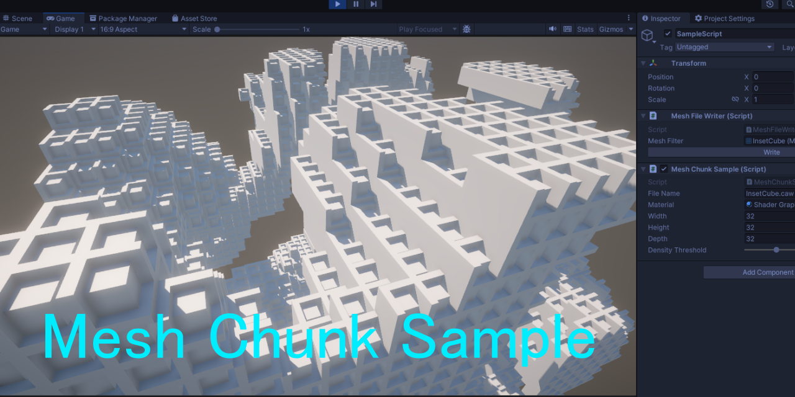

# Runtime Mesh Merging Sample

Welcome to the Runtime Mesh Merging Sample repository!
This project is a sample demonstrating how to merge cube meshes into a single massive mesh without causing significant disruption to the main thread.  



## Features
- **Create Mesh Data Files from Any Mesh:** Included is a tool that allows you to save mesh data in a dedicated format by providing a MeshFilter.  
- **Face Culling:** The dedicated mesh data files contain vertex data divided into six faces of the cube and an other regions to prevent unnecessary faces from being built when merged.  
- **Optimization:** The Job System is employed to minimize background multithreading, ensuring minimal impact on the main thread.  

## Getting Started
Follow these steps to try out the Runtime Mesh Merging Sample:

1. Clone this repository.
1. Open the project from the cloned folder using Unity Hub.
1. Play the sample scene to understand how mesh merging is performed.

# ランタイム メッシュ結合サンプル

**ランタイム メッシュ結合サンプル** リポジトリへようこそ！  
このプロジェクトは、メインスレッドに極力迷惑をかけずにキューブメッシュを結合して  
巨大な一つのメッシュを結合して作成するサンプルです。

## 特徴

- **任意のメッシュからメッシュデータファイルを作成:** MeshFilterを渡せば、専用のメッシュデータファイル形式で保存するツールが付属しています。
- **不要面除去:** 専用メッシュデータファイルにはキューブの6面とそれ以外の領域に分かれた頂点データが格納されています、結合したときに  
不要な面が構築されないようにカリングする仕組みが導入されています。
- **最適化:** Job System を用いて極力バックグラウンドマルチスレッド化がほどこされ、メインスレッドに負荷を与えません。

## 始め方

以下の手順に従って、ランタイム メッシュ結合サンプルをお試しできます。

1. このリポジトリをクローンします。
1. Unity Hub 経由でクローンしたフォルダからプロジェクトを開きます。
1. サンプルシーンを開いて再生することでメッシュの結合サンプル処理を理解します。

## How to use

```csharp
using System;
using System.Collections;
using System.IO;
using System.Threading.Tasks;
using Unity.Collections;
using Unity.Collections.LowLevel.Unsafe;
using Unity.Jobs;
using Unity.Mathematics;
using UnityEngine;
using UnityEngine.Rendering;

namespace SimplestarGame
{
    public struct XYZ
    {
        public int x;
        public int y;
        public int z;
    }

    /// <summary>
    /// チャンクメッシュを作成するサンプル
    /// Corutine の yield return null にて、メインスレッドを休めながら
    /// 各種データ作成や書き込み処理を Job 化して、完了を待つ形で実装している
    /// ゲームを実行するとメッシュオブジェクトが作成される形
    /// </summary>
    internal class MeshChunkSample : MonoBehaviour
    {
        public string fileName = "InsetCube.caw";
        public Material material;
        public int width = 32;
        public int height = 32;
        public int depth = 32;
        [Range(0, 1)] public float densityThreshold = 0.25f;

        void Awake()
        {
            Application.targetFrameRate = 60;
        }

        void Start()
        {
            StartCoroutine(this.CoCreateMeshChunk());
        }

        IEnumerator CoCreateMeshChunk()
        {
            var voxelData = new NativeArray<byte>(this.width * this.height * this.depth, Allocator.Persistent);
            var voxcelDataJobHandle = this.GenerateVoxelData(voxelData, this.width, this.height, this.depth);
            while (!voxcelDataJobHandle.IsCompleted)
            {
                yield return null;
            }
            voxcelDataJobHandle.Complete();
            var meshDataArray = Mesh.AllocateWritableMeshData(1);
            var task = Task.Run(() => ReadCAWFileTask());
            while (!task.IsCompleted)
            {
                yield return null;
            }
            task.Wait();
            if (task.Result == null)
            {
                yield break;
            }
            var result = task.Result;

            Mesh.MeshData meshData = meshDataArray[0];
            var xyz = new NativeArray<XYZ>(this.width * this.height * this.depth, Allocator.Persistent);
            var countOffsets = new NativeArray<int>(xyz.Length, Allocator.Persistent);
            for (int x = 0; x < width; x++)
            {
                for (int y = 0; y < height; y++)
                {
                    for (int z = 0; z < depth; z++)
                    {
                        var index = x * this.height * this.depth + y * this.depth + z;
                        xyz[index] = new XYZ { x = x, y = y, z = z };
                        countOffsets[index] = 0;
                    }
                }
            }
            var countJobHandle = new CountChunkVertexJob()
            {
                vertexCounts = result.vertexCounts,
                voxelData = voxelData,
                xyz = xyz,
                results = countOffsets,
                heightDepth = this.height * this.depth,
                height = this.height,
                depth = this.depth
            }.Schedule(xyz.Length, 8);
            while (!countJobHandle.IsCompleted)
            {
                yield return null;
            }
            countJobHandle.Complete();
            int vertexIndexCount = 0;
            for (int index = 0; index < countOffsets.Length; index++)
            {
                var counts = countOffsets[index];
                countOffsets[index] = vertexIndexCount;
                vertexIndexCount += counts;
            }

            meshData.subMeshCount = 1;
            meshData.SetVertexBufferParams(vertexIndexCount, CustomLayoutMesh.VERTEX_ATTRIBUTE_DESCRIPTORS);
            meshData.SetIndexBufferParams(vertexIndexCount, IndexFormat.UInt32);
            NativeArray<int> indexData = meshData.GetIndexData<int>();
            NativeArray<CustomVertexLayout> vertexData = meshData.GetVertexData<CustomVertexLayout>(stream: 0);
            var writeJobHandle = new WriteChunkDataJob()
            {
                vertexCounts = result.vertexCounts,
                voxelData = voxelData,
                xyz = xyz,
                countOffsets = countOffsets,
                heightDepth = this.height * this.depth,
                height = this.height,
                depth = this.depth,
                fileVertexData = result.fileVertexData,
                indexData = indexData,
                vertexData = vertexData
            }.Schedule(xyz.Length, 8);
            while (!writeJobHandle.IsCompleted)
            {
                yield return null;
            }
            writeJobHandle.Complete();
            countOffsets.Dispose();
            xyz.Dispose();

            float3x2 bounds = new float3x2();
            bounds.c0 = math.min(bounds.c0, new float3(-0.5f, -0.5f, -0.5f));
            bounds.c1 = math.max(bounds.c1, new float3(this.width + 0.5f, this.height + 0.5f, this.depth + 0.5f));

            result.fileVertexData.Dispose();
            result.vertexCounts.Dispose();
            voxelData.Dispose();
            Mesh newMesh = CreateMesh(ref meshDataArray, vertexIndexCount, bounds);
            vertexData.Dispose();
            indexData.Dispose();
            GameObject newGameObject = new GameObject("TestCubeMeshObject");
            newGameObject.AddComponent<MeshFilter>().sharedMesh = newMesh;
            newGameObject.AddComponent<MeshRenderer>().sharedMaterial = this.material;
            NativeArray<int> meshIds = new NativeArray<int>(1, Allocator.Persistent);
            meshIds[0] = newMesh.GetInstanceID();
            var bakeMeshJob = new BakeMeshJob(meshIds);
            var bakeMeshJobHandle = bakeMeshJob.Schedule(meshIds.Length, 1);
            while (!bakeMeshJobHandle.IsCompleted)
            {
                yield return null;
            }
            bakeMeshJobHandle.Complete();
            meshIds.Dispose();
            newGameObject.AddComponent<MeshCollider>().sharedMesh = newMesh;
        }

        class TaskResult
        {
            public NativeArray<int> vertexCounts;
            public NativeArray<CustomVertexLayout> fileVertexData;
        }

        TaskResult ReadCAWFileTask()
        {
            NativeArray<int> vertexCounts;
            NativeArray<CustomVertexLayout> fileVertexData;
            if (!UnsafeReadCAWFile(Path.Combine(Application.streamingAssetsPath, this.fileName), out vertexCounts, out fileVertexData))
            {
                return null;
            }
            return new TaskResult
            {
                vertexCounts = vertexCounts,
                fileVertexData = fileVertexData
            };
        }

        /// <summary>
        /// メッシュの作成
        /// </summary>
        /// <param name="meshDataArray">データ設定済みメッシュデータ</param>
        /// <param name="vertexIndexCount">インデックス数=頂点数</param>
        /// <param name="bounds">バウンディングボックス情報</param>
        /// <returns>メッシュ</returns>
        static Mesh CreateMesh(ref Mesh.MeshDataArray meshDataArray, int vertexIndexCount, float3x2 bounds)
        {
            Mesh.MeshData meshData = meshDataArray[0];
            var newMesh = new Mesh();
            newMesh.name = "CustomLayoutMesh";
            newMesh.bounds = new Bounds((bounds.c0 + bounds.c1) * 0.5f, bounds.c1 - bounds.c0);
            meshData.SetSubMesh(0, new SubMeshDescriptor
            {
                topology = MeshTopology.Triangles,
                vertexCount = vertexIndexCount,
                indexCount = vertexIndexCount,
                baseVertex = 0,
                firstVertex = 0,
                indexStart = 0,
                bounds = newMesh.bounds
            }, MeshUpdateFlags.DontRecalculateBounds | MeshUpdateFlags.DontValidateIndices | MeshUpdateFlags.DontNotifyMeshUsers);
            Mesh.ApplyAndDisposeWritableMeshData(meshDataArray, new[] { newMesh },
                MeshUpdateFlags.DontRecalculateBounds | MeshUpdateFlags.DontValidateIndices | MeshUpdateFlags.DontNotifyMeshUsers);
            return newMesh;
        }

        /// <summary>
        /// ファイルから頂点データの読み込み
        /// </summary>
        /// <param name="filePath">ファイルパス</param>
        /// <param name="vertexCounts">成功時、Disposeする必要あり</param>
        /// <param name="vertexData">成功時、Disposeする必要あり</param>
        /// <returns>成功時true</returns>
        static unsafe bool UnsafeReadCAWFile(string filePath, out NativeArray<int> vertexCounts, out NativeArray<CustomVertexLayout> vertexData)
        {
            vertexCounts = new NativeArray<int>(7, Allocator.Persistent);
            int fileSize = 0;
            try
            {
                fileSize = (int)new FileInfo(filePath).Length;
            }
            catch (FileNotFoundException e)
            {
                Debug.LogError($"指定したファイルがありません: {e.Message}");
                vertexData = new NativeArray<CustomVertexLayout>(1, Allocator.Persistent);
                vertexData.Dispose();
                vertexCounts.Dispose();
                return false;
            }
            var headerByteCount = 4 + 7 * sizeof(int);
            var vertexCount = (fileSize - headerByteCount) / sizeof(CustomVertexLayout);
            var magicCode = new NativeArray<byte>(4, Allocator.Persistent);
            vertexData = new NativeArray<CustomVertexLayout>(vertexCount, Allocator.Persistent);
            var success = false;
            using (BinaryReader reader = new BinaryReader(File.Open(filePath, FileMode.Open)))
            {
                reader.Read(new Span<byte>(magicCode.GetUnsafePtr(), magicCode.Length));
                if (magicCode[0] == 'c' && magicCode[1] == 'a' && magicCode[2] == 'w')
                {
                    reader.Read(new Span<byte>(vertexCounts.GetUnsafePtr(), vertexCounts.Length * sizeof(int)));
                    reader.Read(new Span<byte>(vertexData.GetUnsafePtr(), vertexData.Length * sizeof(CustomVertexLayout)));
                    success = true;
                }
                else
                {
                    vertexData.Dispose();
                    vertexCounts.Dispose();
                }
            }
            magicCode.Dispose();
            return success;
        }

        /// <summary>
        /// ボクセルデータの作成
        /// </summary>
        /// <param name="voxelData">0が空気255が充填を意味する、関数外で width * height * depth サイズで確保済み</param>
        /// <param name="width">幅</param>
        /// <param name="height">高さ</param>
        /// <param name="depth">奥行き</param>
        /// <returns>作成ジョブのハンドル</returns>
        JobHandle GenerateVoxelData(NativeArray<byte> voxelData, int width, int height, int depth)
        {
            return new VoxelGenerationJob
            {
                VoxelData = voxelData,
                Width = width,
                Height = height,
                Depth = depth,
                DensityThreshold = densityThreshold
            }.Schedule(voxelData.Length, 64);
        }
    }
}

```

## License
This project is licensed under the MIT License.

## Contribution
If you find a bug, have an enhancement idea, or want to contribute in any other way, please open an issue or submit a pull request.
